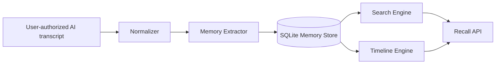

<div align="center">

# 🧠 Recall-AI

### Search your past AI conversations like a memory system.

**A personal AI memory layer that turns scattered ChatGPT, Claude, Gemini and other assistant conversations into searchable decisions, ideas, tasks and timelines.**

`Chat History → Memory Extraction → Search → Timeline → Recall`


</div>

---

## The problem

People are building real work inside AI conversations: architecture decisions, research, code, requirements, ideas and unfinished tasks. Months later, that knowledge is difficult to find because it is buried across dozens or hundreds of chats and multiple AI providers.

**Recall-AI turns that scattered history into structured, searchable memory.**

Instead of asking, "Which chat was that in?", users can ask things like:

- "When did I decide to use Pinecone?"
- "Why did I switch from FAISS to Pinecone?"
- "What tasks did I say I would finish but never complete?"
- "Show the timeline of decisions for my healthcare RAG project."
- "Find every conversation where I discussed MCP."

---

## Core idea

```text
ChatGPT ─────┐
Claude ──────┤
Gemini ──────┼────► Recall-AI
Other AI ────┘          │
                        ▼
              Conversation Normalization
                        │
                        ▼
                 Memory Extraction
        ┌───────────────┼───────────────┐
        ▼               ▼               ▼
     Decisions         Tasks           Facts
        │               │               │
        └───────────────┼───────────────┘
                        ▼
                  Memory Store
                        │
          ┌─────────────┼─────────────┐
          ▼             ▼             ▼
        Search        Timeline      Recall API
```

---

## What the MVP already supports

| Capability | Status |
|---|:---:|
| Provider-neutral conversation ingestion | ✅ |
| Memory extraction | ✅ |
| Decision detection | ✅ |
| Requirement detection | ✅ |
| Open-task detection | ✅ |
| Persistent SQLite memory store | ✅ |
| Keyword relevance search | ✅ |
| Project/topic timeline | ✅ |
| REST API with FastAPI | ✅ |
| Automated tests | ✅ |
| Docker support | ✅ |
| Embedding search | 🚧 |
| LLM semantic extraction | 🚧 |
| Contradiction detection | 🚧 |
| Knowledge graph memory | 🚧 |
| ChatGPT / Claude / Gemini export adapters | 🚧 |

---

## Memory model

Recall-AI does not store only raw transcripts. It extracts reusable memory units.

```json
{
  "kind": "decision",
  "content": "Use Pinecone for vector retrieval",
  "project": "healthcare-rag",
  "provider": "gemini",
  "source_conversation_id": "conv-184",
  "created_at": "2026-08-20T12:00:00Z"
}
```

Supported memory categories in the MVP:

`decision` · `requirement` · `task` · `fact` · `note`

---

## Architecture



The architecture intentionally separates provider ingestion from memory representation so future adapters can support different export formats without rewriting the core memory engine.

---

## Run locally

```bash
git clone https://github.com/vaishnavi-265/Recall-AI.git
cd Recall-AI
python -m venv .venv
```

Activate the environment and install dependencies:

```bash
pip install -r requirements.txt
uvicorn app.main:app --reload
```

Swagger UI:

```text
http://127.0.0.1:8000/docs
```

Or run with Docker:

```bash
docker build -t recall-ai .
docker run -p 8000:8000 recall-ai
```

---

## API examples

### Ingest a conversation

```http
POST /v1/conversations/ingest
```

```json
{
  "conversation_id": "conv-001",
  "provider": "chatgpt",
  "project": "contextbridge",
  "messages": [
    {"role": "user", "content": "We decided to use FastAPI for the backend."},
    {"role": "assistant", "content": "The API will expose portable context endpoints."},
    {"role": "user", "content": "Next we need to add MCP support."}
  ]
}
```

### Search memory

```http
GET /v1/memories/search?q=FastAPI
```

### View a project timeline

```http
GET /v1/timeline/contextbridge
```

### Find open tasks

```http
GET /v1/tasks/open
```

---

## Why this project matters

AI assistants are becoming places where people accumulate **working memory**. The problem is that this memory is fragmented by conversation, provider and time.

Recall-AI explores a more useful model:

> **Your AI conversations should become a searchable knowledge layer, not a forgotten archive.**

---

## Roadmap

### Phase 1 — Memory Core
- [x] Conversation ingestion
- [x] Provider-neutral schemas
- [x] Structured memory extraction
- [x] Persistent memory storage
- [x] Search API
- [x] Timeline API
- [x] Open-task API

### Phase 2 — Semantic Memory
- [ ] Sentence-transformer embeddings
- [ ] Vector similarity search
- [ ] Hybrid keyword + semantic retrieval
- [ ] Re-ranking
- [ ] Query rewriting

### Phase 3 — Memory Intelligence
- [ ] LLM-based semantic extraction
- [ ] Decision reasoning: "Why did I decide this?"
- [ ] Contradiction detection
- [ ] Superseded-decision tracking
- [ ] Entity and project linking
- [ ] Memory confidence scores

### Phase 4 — Multi-provider Recall
- [ ] ChatGPT export adapter
- [ ] Claude export adapter
- [ ] Gemini export adapter
- [ ] Duplicate conversation detection
- [ ] Cross-provider memory graph

### Phase 5 — Personal AI Memory Platform
- [ ] Web dashboard
- [ ] Memory timeline visualization
- [ ] Knowledge graph UI
- [ ] MCP server for personal memory retrieval
- [ ] Local-first encrypted storage option

---

## Privacy model

Recall-AI is designed for **user-authorized conversation exports**. It does not scrape private accounts or bypass provider permissions. Future versions will add selective redaction, encryption and local-first processing for sensitive memories.

---

<div align="center">

## 👩‍💻 Author

### Vaishnavi Kandakatla

**AI Engineer · Software Engineer**

Building systems across **Agentic AI, RAG, MCP, LLM applications, memory systems and enterprise AI automation.**

[](https://github.com/vaishnavi-265)

### `Don't search through old chats. Recall what mattered.`

</div>
